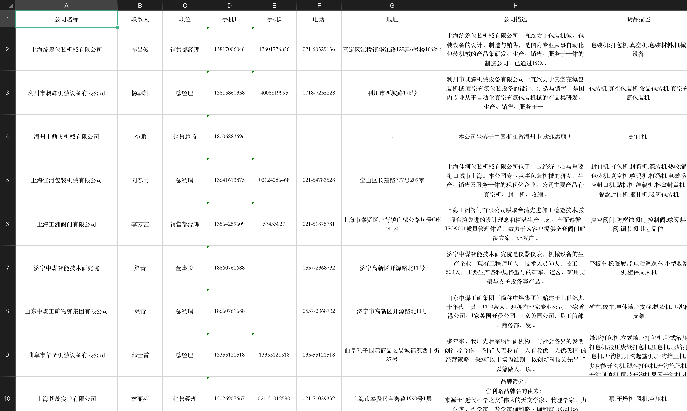

# 安装插件

该插件依赖[sunday](https://github.com/pysunday/pysunday), 需要先安装sunday

执行sunday安装目录：`sunday_install tools-huicong`

## huicong命令使用

```bash
 $ huicong -h
 usage: huicong [-v] [-h] [-t TYPENAME] [-l] [-r RANGE]

慧聪网供应商信息采集

Optional:
  -v, --version                 当前程序版本
  -h, --help                    打印帮助说明
  -t TYPENAME, --type TYPENAME  类型
  -l, --list                    全部类型
  -r RANGE, --range RANGE       采集范围

使用案例:
    huicong -l
    huicong -t y791o07blv
    huicong -r 1-10
    huicong
```

## 数据结果


